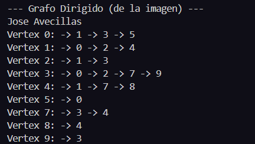

# Práctica de Algoritmos de Ordenamiento

## 📌 Información General

- **Título:** Práctica de Algoritmos de Ordenamiento
- **Asignatura:** Estructura de Datos
- **Carrera:** Computación
- **Estudiante:** Jose Avecillas
- **Fecha:** 10-7-2024
- **Profesor:** Ing. Pablo Torres

---

## 🛠️ Descripción

Agregamos los grafos con nodo y set para que no se repitan


---

## 🚀 Ejecución

Para ejecutar el proyecto:

1. Compila el código:
    ```bash
    javac App.java
    ```
2. Ejecuta la aplicación:
    ```bash
    java App
    ```

---

## 🧑‍💻 Ejemplo de Entrada

```plaintext

```

---

